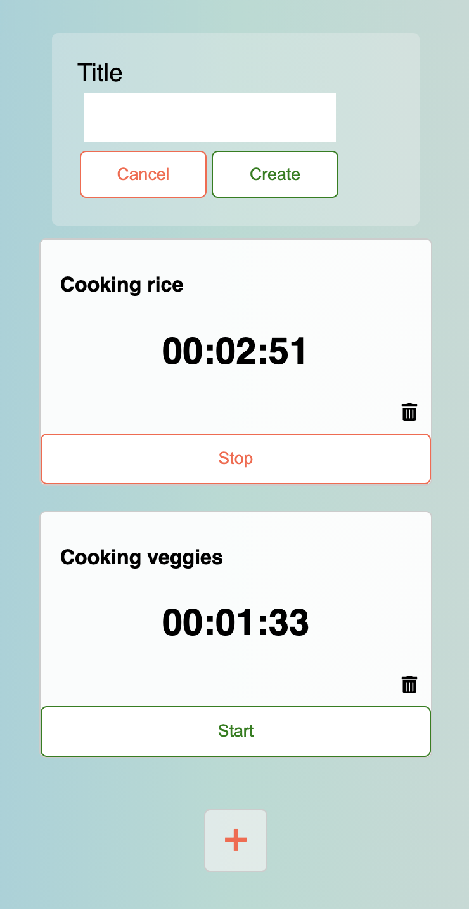

# Timer

Web app that lets you set multiple timers

[Vist the site](https://create-my-timers.herokuapp.com/)

## Getting Started

- To test this app locally, fork and clone this repo

### Installing

- Install all dependencies by running: `npm install`

### Executing Program

- Start the app by running: `npm start`
- Open [http://localhost:3000](http://localhost:3000) to view it in the browser.

### Built with

- [React](https://reactjs.org/) - JS library
- [react-icons](https://react-icons.github.io/react-icons) - icons library
